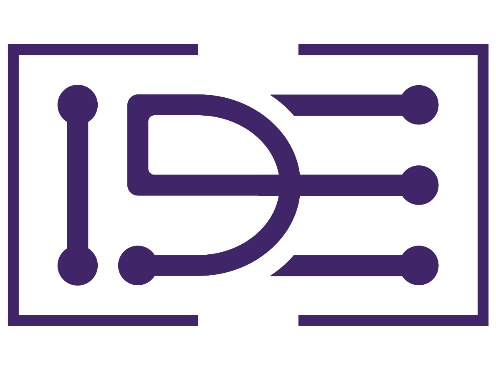

<p align="center">
  
</p>

<h1 align="center">Novo Site da IDE</h1>

## Como Executar o Projeto Localmente

### Passo a Passo
1. Acesse a pasta do projeto:

    ```bash
    cd ide-site
    ```

2. Instale as dependências:

    ```bash
    npm install
    ```

3. Configure as variáveis de ambiente:

    ```bash
    cp .env.example .env.local
    ```

    Após copiar o arquivo `.env.example`, preencha as variáveis de ambiente necessárias em `.env.local`.

4. Suba os containers do Docker:

    ```bash
    docker compose up -d
    ```

5. Inicie o servidor de desenvolvimento:

    ```bash
    npm run dev
    ```

#### Painel Administrativo do Blog

Após iniciar o projeto, acesse a URL local exibida no terminal, adicionando `/admin` ao final.

Exemplo:

`http://localhost:3000/admin`